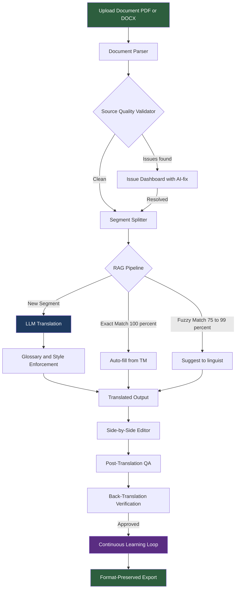

# 🌐 LinguaAI — AI-Powered Translation Studio
### INSPIRON 5.0 — National Level Hackathon | Problem Statement 02
**Computer Society of India · COEP Tech Student Chapter · Domain: Enterprise AI / NLP**

🔗 **Live Demo:** https://vaishnavi27711.github.io/LinguaAi/
---

> **Core Challenge:** Enterprise translation workflows suffer from inconsistent terminology, no translation reuse, source quality issues, disconnected workflows, and no continuous learning. Build an AI-powered translation studio that validates source quality, reuses historical translations via RAG, translates with glossary and style enforcement, and continuously learns from human-approved corrections.

---

## 📌 The Problem

Organizations operating across multilingual markets rely on accurate, consistent document translation. The volume of content requiring translation — contracts, member communications, regulatory filings, marketing materials — is growing rapidly, but translation workflows remain fragmented and inefficient.

| Problem | What Goes Wrong |
|---|---|
| **Inconsistent Terminology** | Same term translated differently — e.g. "PM" vs "P.M." vs "p.m." — leading to confusion and compliance risks |
| **No Translation Reuse** | Previously approved translations not surfaced for new projects. Linguists re-translate identical content, wasting time and introducing variation |
| **Source Quality Issues** | Spelling errors, inconsistent punctuation, missing spaces, formatting issues multiply across every target language |
| **Disconnected Workflows** | Translation, proofreading, approval, and dictionary updates happen in separate tools with no unified audit trail |
| **No Continuous Learning** | Translation models and glossaries remain static with no mechanism to improve from approved corrections |

---

## 🏗️ System Architecture



---

## ✨ Core Features

### 1. 📥 Upload & Parse Documents
- Accepts **PDF** and **DOCX** files
- Extracts translatable content while **preserving structure** — headings, tables, lists
- Segments source text at sentence and phrase level for granular TM matching
- **Source Document Improvement** *(Bonus)* — AI-powered grammar correction before translation

### 2. 🔍 Source Quality Validation Engine
- **Context-aware spell check** with domain-specific terminology support
- **Consistency analysis** — flags terminology and formatting variations (e.g. "PM" vs "P.M." vs "p.m.")
- **Punctuation & grammar validation** — missing spaces, double spaces, inconsistent comma usage
- **Formatting checks** — date formats, number formats, capitalisation patterns
- Visual issue dashboard with **High / Medium / Low severity** classification and batch AI-fix suggestions

### 3. 🧠 Translation Memory + RAG Pipeline
- **RAG Pipeline:** Segment → Generate Embeddings → Vector Search TM → Classify (Exact / Fuzzy / New) → LLM for unmatched segments
- Stores every approved source–target pair at sentence and phrase level
- **Exact match (100%)** → auto-fill · **Fuzzy match (75–99%)** → suggest to linguist
- TM versioning with rollback · Customisable match thresholds per project

### 4. 🌍 Translate with LLM
- Supports **Claude (Anthropic), Gemini 1.5 Flash (Google), GPT-4o (OpenAI), or Ollama locally**
- Supports multiple target languages: **Spanish, Japanese, French, German, Portuguese, Italian, Korean**
- Style/tone profile injected directly into system prompt

### 5. 📖 Glossary & Terminology Management
- Per-language-pair glossaries with source term, target term, and context notes
- LLM **constrained via prompt engineering** to use approved terms
- Grammatical context adaptation · Conflict detection · Auto-suggest
- **Import/export in TBX, TMX, XLIFF** for CAT tool interoperability

### 6. 🎨 Style & Tone Profiles
- Tone options: **Formal · Official · Conversational · Technical · Social · Friendly · Diplomatic**
- Predefined + custom free-text style rules
- Bundle glossaries, style rules, and TMs into **reusable profiles per project or team**
- **AI-generated style rules** from sample brand text

### 7. ✅ Proofreading & Approval Workflow
- **Side-by-side editor** — accept/edit/reject per segment
- **Multi-level approval workflow** with full audit trail
- On approval: TM updated, glossary enriched, corrections batched for fine-tuning

### 8. 🔄 Train & Learn Continuously
- Import bilingual document pairs *(TMX, XLIFF, TBX)* to seed TM from day one
- After each approval: update TM → enrich glossary → batch for optional LLM fine-tuning
- TM versioning with rollback

### 9. ✅ Post-Translation QA *(Bonus)*
- Tag consistency, number accuracy, length validation, cross-document consistency

### 10. 🔁 Back-Translation Verification *(Bonus)*
- Three-way comparison: Original Source vs Translation vs Back-Translated

### 11. 📊 Analytics Dashboard *(Bonus)*
- TM leverage rate, linguist productivity, quality trends, cost savings estimator

---

## 🚀 Quick Start

### View the Live Demo
🔗 [https://vaishnavi27711.github.io/linguaai](https://vaishnavi27711.github.io/linguaai)

### Run the Demo Script Locally
> Requires Python 3.10+ and an LLM API key (Claude / Gemini / GPT-4o / Ollama)

```bash
git clone https://github.com/vaishnavi27711/linguaai.git
cd linguaai
pip install -r requirements.txt
cp .env.example .env
# Add your API key to .env
python scripts/translate_with_glossary.py
```

---

## 📁 Project Structure

```
linguaai/
├── index.html                           # Live UI mockup (GitHub Pages)
├── scripts/
│   └── translate_with_glossary.py       # Demo: Glossary enforcement + LLM API
├── glossaries/
│   └── en_es_glossary.json              # English → Spanish domain glossary
├── docs/
│   └── architecture.md                  # Extended RAG pipeline notes
├── requirements.txt
├── .env.example
├── .gitignore
├── CONTRIBUTORS.md
└── README.md
```

---

## 🛠️ Full Tech Stack (Round 2)

| Component | Recommended Approach |
|---|---|
| **Document Parsing** | python-docx, pdfplumber |
| **Embeddings / RAG** | sentence-transformers + ChromaDB |
| **LLM** | Claude · Gemini 1.5 Flash · GPT-4o · Ollama |
| **Glossary & Style** | Prompt engineering — inject rules into LLM system prompt |
| **Backend API** | FastAPI (Python) |
| **Frontend** | React + TypeScript + TailwindCSS |
| **Glossary Format** | TBX · TMX · XLIFF |
| **Deployment** | Docker Compose · Vercel · Railway/Render |

---

## 📊 Evaluation Criteria Alignment

| Criterion | Our Approach |
|---|---|
| **Innovation & Use of AI** | RAG pipeline + glossary-constrained prompting + continuous learning loop |
| **Functionality** | Full pipeline: upload → validate → TM/RAG → translate → QA → back-translate → approve → export |
| **Usability (UI/UX)** | Side-by-side editor, severity dashboard, one-click AI fixes, analytics |
| **Scalability** | Modular pipeline; ChromaDB scales with TM; stateless FastAPI |
| **Presentation Skills** | Architecture diagram, live demo, precise problem framing |
| **Adherence to Timelines** | Round 1 submitted; Round 2 build plan defined |

---

## 🎁 Bonus Features Planned for Round 2

- ✅ **Source Document Improvement** — AI grammar correction before translation
- ✅ **Format-Preserved Export** — translated documents in original PDF/DOCX layout
- ✅ **Real-Time Collaboration** — multiple linguists on the same document simultaneously
- ✅ **CAT Tool Interoperability** — import/export TMX, XLIFF, TBX files
- ✅ **Post-Translation QA** — tag consistency, number accuracy, length validation
- ✅ **Analytics Dashboard** — TM leverage rate, productivity, quality trends, cost savings
- ✅ **Back-Translation Verification** — three-way comparison view
- ✅ **API Integration** — REST APIs for CI/CD and automated translation workflows

---

## 👥 Team — Coder's Clique

| Name | GitHub |
|---|---|
| Vaishnavi Karande *(Team Leader)* | [@vaishnavi27711](https://github.com/vaishnavi27711) |
| Samruddhi More | [@Samruddhi-2110](https://github.com/Samruddhi-2110) |
| Sanskruti Kunjir | [@Sanskruti-Kunjir](https://github.com/Sanskruti-Kunjir) |
| Pranali Wadghule | [@pranali-200610](https://github.com/pranali-200610) |

> **Coder's Clique** · COEP Technological University, Pune
> Submitted for INSPIRON 5.0 — Problem Statement 02: AI-Powered Translation Studio
